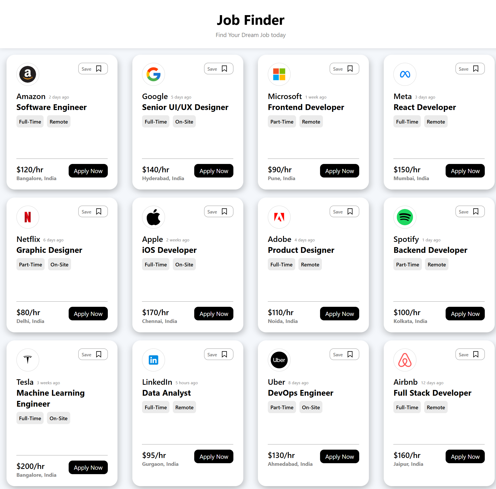

# Job Finder UI

A modern and responsive Job Finder UI built using ReactJS and Vite.

## Preview



## Features

- Responsive job cards UI
- Reusable React components
- Dynamic rendering using `.map()`
- Interactive hover effects
- Modern flexbox layout
- Clean and minimal design

## Tech Stack

- ReactJS
- Vite
- CSS3
- JavaScript (ES6)

## Folder Structure

```bash
src
 ┣ assets
 ┃ ┗ bookmark-icon.svg
 ┣ components
 ┃ ┗ Card.jsx
 ┣ App.jsx
 ┣ index.css
 ┗ main.jsx
```

## Installation

Clone the repository:

```bash
git clone https://github.com/the-vivek-codes/react-ui-projects
```

Move into the project folder:

```bash
cd react-ui-projects/job-finder-ui
```

Install dependencies:

```bash
npm install
```

Run the development server:

```bash
npm run dev
```


## Author

Vivek Kumar Dwivedi