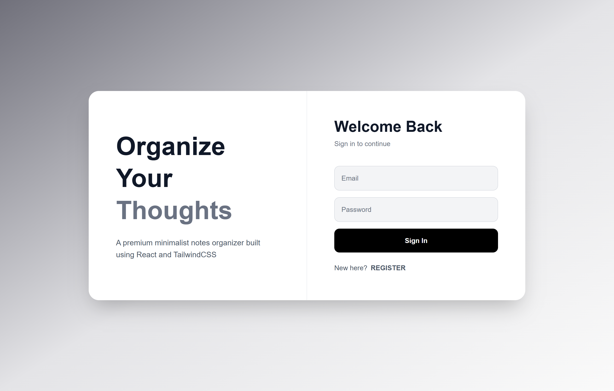
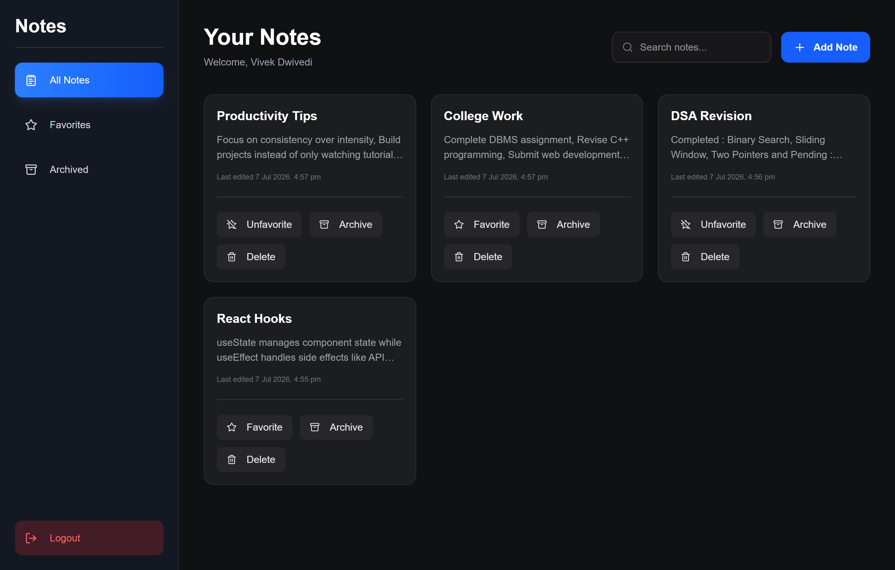

# Notes Organizer

A premium minimalist notes organizer built using React and Tailwind CSS.

## Authentication Page



## Dashboard Preview



## Features

* User Authentication
* Protected Dashboard
* Create, Edit and Delete Notes
* Favorite and Archive Notes
* Search Functionality
* Local Storage Persistence
* Last Edited Timestamp
* Responsive Modern UI
* Smooth Animations

## Tech Stack

* React
* Vite
* Tailwind CSS
* React Router DOM
* Framer Motion
* Local Storage

## Installation

Clone the repository:

```bash
git clone https://github.com/the-vivek-codes/react-ui-projects
```

Move into the project folder:

```bash
cd react-ui-projects/notes-organizer
```

Install dependencies:

```bash
npm install
```

Run the development server:

```bash
npm run dev
```